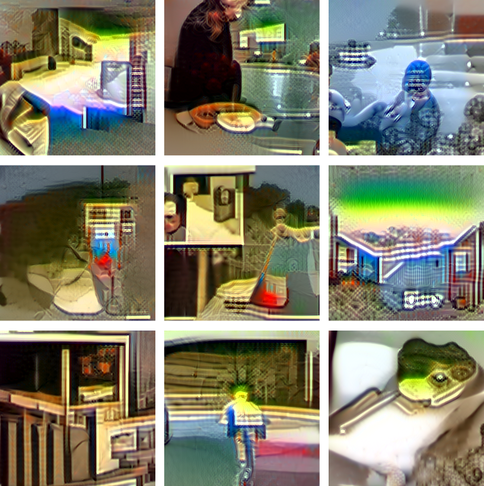
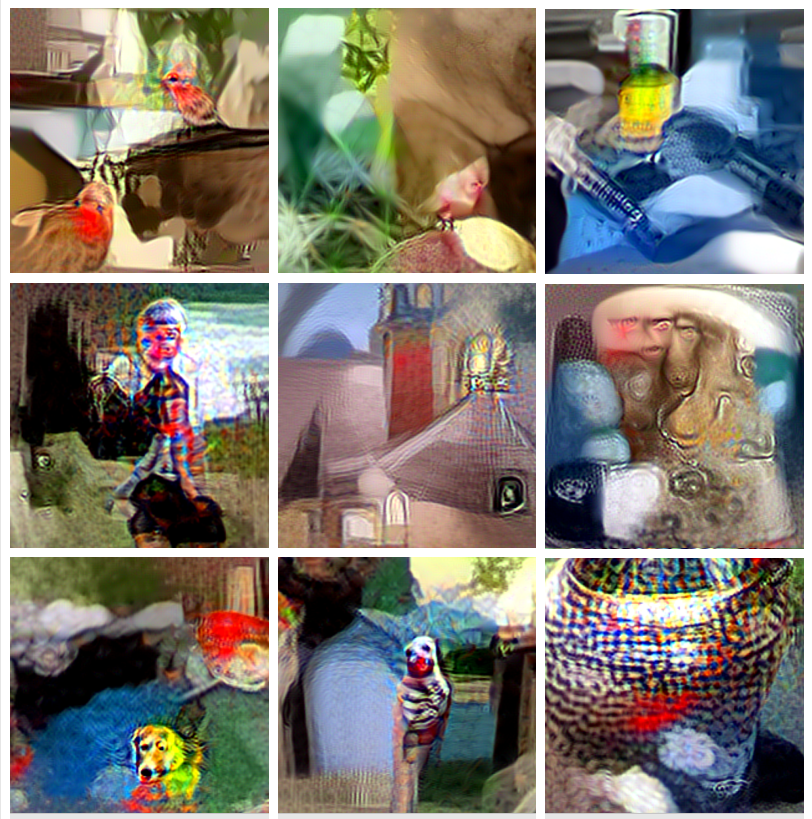

# DGH: Data Generation for Hardware-Friendly Post-Training Quantization


## Introduction
This repository contains the Pytorch implementation of **DGH** as described in the paper [**"Data Generation for Hardware-Friendly Post-Training Quantization"**](https://arxiv.org/abs/2410.22110) (WACV 2025). 

DGH is a method for generating images designed to improve model performance in zero-shot quantization. 

<table>
  <tr>
    <td>
      <figure>
        
        <figcaption>Images generated from a ResNet18 using DGH using 40k Iterations. </figcaption>
      </figure>
    </td>
    <td>
      <figure>
        
        <figcaption>Images generated from a ResNet18 using DGH using 1k Iteration.</figcaption>
      </figure>
    </td>
  </tr>
</table>


## Pretrainied Models
The pretrained models in this repository are taken from [BRECQ](#https://github.com/yhhhli/BRECQ) [1].
To run a model, you need to download its checkpoints as detailed in BRECQ's repository and demonstrated in the following example:
```
wget https://github.com/yhhhli/BRECQ/releases/download/v1.0/resnet18_imagenet.pth.tar
```
## Setup
### Clone the Repository
First, clone the repository to your local machine:
```angular2html
git clone https://github.com/yourusername/DGH.git
cd DGH
```

###  Install the Requirements
Install the required Python packages using pip: 
```
pip install -r requirements.txt
```
## Usage

### Generate Images, Quantize Using BRECQ, and Evaluate on ImageNet1K Validation Set
This section provides instructions on how to generate synthetic images, perform quantization using BRECQ, and evaluate the quantized models on the ImageNet1K validation set. Below are examples for different models: ResNet18, ResNet50, and MobileNetV2.

#### ResNet18 
To generate images, quantize using BRECQ, and evaluate the ResNet18 model, run the following command:
```bash
python main.py \
--data_path PATH/TO/IMAGENET/FOLDER \
--model_name resnet18 \
--calib_data_type dgh \
--n_images 1024 \
--weights_n_bits 4 \
--activation_n_bits 4 \
--act_quant \
--output_loss_factor 3e-7  
```
**Parameters:**
- `--data_path`: Path to the ImageNet dataset folder.
- `--model_name`: Specifies the model architecture (e.g., resnet18).
- `--calib_data_type`: Type of calibration data.
- `--n_images`: Number of synthetic images to generate.
- `--weights_n_bits`: Number of bits for weight quantization.
- `--activation_n_bits`: Number of bits for activation quantization.
- `--act_quant`: Enables activation quantization.
- `--output_loss_factor`: Weight for the output loss term in optimization.

**Example Output:**
```angular2html
Top1 accuracy results on ImageNet1k validation set: 
----> Weight only quantization: 70.51%
----> Full quantization (weights + activations): 66.592%
```
#### ResNet50
For the ResNet50 model, use the following command with adjusted output_loss_factor:
```bash
python main.py \
  --data_path PATH/TO/IMAGENET/FOLDER \
  --model_name resnet50 \
  --calib_data_type dgh \
  --n_images 1024 \
  --weights_n_bits 4 \
  --activation_n_bits 4 \
  --act_quant \
  --output_loss_factor 1e-7
```
#### MobileNetV2:
To quantize the MobileNetV2 model, include the `--weight` parameter to adjust the weighting factor in the BRECQ quantization algorithm:
```bash
python main.py \
  --data_path PATH/TO/IMAGENET/FOLDER \
  --model_name mobilenet_v2 \
  --calib_data_type dgh \
  --n_images 1024 \
  --weights_n_bits 4 \
  --activation_n_bits 4 \
  --act_quant \
  --output_loss_factor 3e-5 \
  --weight 0.1
  ```

## Repository Structure
```bash
dgh/
│
├── brecq/
│   └── # Contains BRECQ-quantization algorithm related modules and utilities
│
├── data_loaders/
│   └── # Data loading utilities
│
├── dgh/
│   ├── data_generation.py              # The main function for generating images (DGH)
│   ├── default_functions.py            # Default functions used in the image generation process
│   ├── image_pipeline.py               # The image processing pipeline
│   ├── layer_weighting_functions.py    # Functions for layer weighting in models, currently only average weighting
│   ├── lr_scheduler.py                 # Learning rate scheduler functions
│   ├── model_info_exctractors.py       # Model information extractors, such as BNs and activations
│   ├── optimization_utils.py           # All image optimization related classes
│   ├── output_loss.py                  # Output loss function
│
├── model_evaluation/
│   └── # Scripts for evaluating model performance
│
├── model_params/
│   └── # Saved model parameters for running and model related utilities
│
├── constants.py                      # Constant definitions and configurations
├── image_preprocessing_utils.py      # Image processing utilities 
├── main.py                           # Main script to run the DGH pipeline
├── utils.py                          # Utility functions for general purposes
├── README.md                         # Project overview and running instructions
```

## Citation
If you use this code or find it helpful in your research, please consider citing our work:
```angular2html
@misc{dikstein2024datagenerationhardwarefriendlyposttraining,
      title={Data Generation for Hardware-Friendly Post-Training Quantization}, 
      author={Lior Dikstein and Ariel Lapid and Arnon Netzer and Hai Victor Habi},
      year={2024},
      eprint={2410.22110},
      archivePrefix={arXiv},
      primaryClass={cs.LG},
      url={https://arxiv.org/abs/2410.22110}, 
}
```

## References:
[1] Li, Yuhang, et al. "BRECQ: Pushing the Limit of Post-Training Quantization by Block Reconstruction." ICLR 2021.

## License
This project is released under the [Apache 2.0 License](LICENSE).